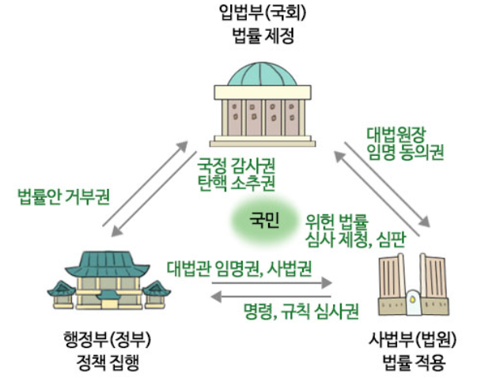
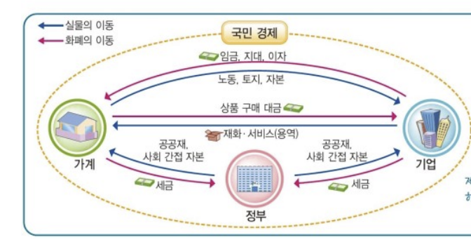

# 사회 ㅋ (Four times)

## 1. 인간, 사회, 환경과 행복

- 시간적 관점 
    - 의미 : `시대적 배경`과 `맥락`을 바탕으로 역사적인 사실로 의미를 부여하는 관점
    - 특징 : 과거를 돌아봄으로 현재의 `사회현상이해` 및 `문제해결`
- 공간적 관점
    - 의미 : 공간 정보를 바탕으로 인간 활동을 설명하는 관점
    - 특징 : 차이를 이해하고 자연/인문 환경이 인간에게 미친 영향 파악
- 사회적 관점
    - 의미 : `사회 구조`나 `사회 제도`의 영향을 받는다는 점을 고려하여 개인의 행위와 사회 현상을 이해하는 관점.
    - 특징 : 사회현상의 `구조적원인`을 파악하여 `정책마련`
- 윤리적 관점
    - 의미 : 행위의 좋고 나쁨, 옳고 그름과 관련해 어떤 행위가 도덕적이며, 어떤 `가치`와 `규범`을 지향해야 하는지 살펴보는 관점.
    - 특징 : 사회가 나아가야 하는 `방향성` 제시.
- 통합적 관점
    - 의미 : 하나의 사회적 현상을 탐구할 때 위 관점들을 모두 고려하여 살펴보는 관점
    - 필요성 
        - 다양한 요인이 서로 영향을 주고 받고, `사실`과 `가치`의 문제가 섞여 나타나기 때문
        - 사실 관계를 정확히 파악 후 판단을 내림으로 사회 현상 `깊이이해`, 인류의 삶 `개선`

- 행복의 다양한 기준
    - 행복의 구체적 기준은 `지역적 여건`과 `시대적 상황`에 따라 다르게 나타남.
    - 공통점 : 일상생활 속에서 충분한 만족과 기쁨을 느껴 흐뭇한 상태를  행복으로 여김.

- 행복론
    - 유교 : 인을 실현하는 것.
    - 불교 : 수행과 실천을 통해 해탈의 경지에 이르는 것.
    - 도교 : 자연 그대로의 모습으로 살아가는 것.
    - 고대 그리스(아리스토텔레스) : 행복 = 삶의 궁극적 목적, 이성의 기능 발휘
    - 헬레니즘 시대
        - 에피쿠로스 학파 : 육체에 고통이 없고 마음에 불안이 없음 ( 쾌락 )
        - 스토아 학파 : 초연한 태도로 자연의 질서에 따라 사는 것.
    - 중세 : 신과 하나 되는 것으로, 신앙 생활을 통해 행복 달성
    - 근대 
        - 의무론(칸트) : 도덕 법칙 실천
        - 공리주의 : 행복 = 쾌락, 최대 다수에게 최대 행복을 주는 행위 추구  

- 행복한 삶을 위한 조건
    - 질 높은 정주 환경
        - 우리가 자리 잡고 살아가는 터전을 둘러싼 환경.
        - 좁은의미 : 주거 환경, 넓은 의미 : 일상생활의 전 영역.
        - 범죄율이 낮고 안정된 곳.
        - 정서적 유대감을 느끼고, 장소나 공간은 사람들의 기억과 역사를 담고 있음.
    - 경제적 안정
        - 기본적 삶의 조건 충족, 삶의 질 유지를 위해 필요함.
        - 국민에게 쾌적한 환경, 질 높은 의료 및 교육 혜택을 제공하는 기초.
        - 국민 소득이 높다고 구성원의 삶의 질이 반드시 높은 것은 아님.
        - 빈부격차를 줄이기 위한 다양한 복지 제도 마련 필요.   
    - 민주주의의 실현
        - 시민이 주권을 가지고 국가를 스스로 다스려야 한다는 이념
        - 자유워 권리를 보장받으며 행복한 삶을 꾸려 나가는 바탕.
    - 도덕적 실천
        - `도덕적사고`, `도덕적감정`, `선하게살고자하는의지`가 있을 때 도덕적 삶 실천.
        - 소크라테스 : 성찰하지 않는 삶은 살 가치가 없다.

## 2. 인권 보장과 헌법

- 인권
    - 의미 : 인간존엄성을 유지하며 살아갈 수 있도록 모든 사람이 누려야 하는 
    - 특징 
        - 보편성 : 차별없이 `인류 구성원 모두`가 가지는 권리
        - 천부성 : 태어나면서부터 갖게 되는 당연한 권리, 하늘로부터 부여받은 권리
        - 불가침성 : 남에게 침해받을 수 없고, 양도할 수 없는 권리
        - 항구성 : 영구히 보장되는 권리.
- 인권 확장의 역사
    - 마그나카르타 : 귀족들이 존왕의 실정에 대항하여 요구한 문서
    - 영국명예혁명 : 의회의 의결 없이 징병, 법률 폐지 불가로 규정
        - 권리장전 - 명예혁명의 결과물.
        - 의회 중심의 `입헌군주제` 토대 마련. (중요함)
    - 버지니아 권리장전 : 시민의 천부인권 선언, 행복 추구권 등 규정
    - 프랑스 혁명 : 인간과 시민의 권리 선언.
        - 자유권, 국민 주권, 권력 분립 등 규정
        - 권리의 주체 : 재산 있는 성인 남자 (시민)
    - 참정권 확대 운동 : 차티스트 운동, 여성참정권 확대 운동
    - 바이마르 헌법 : 최초로 사회권 규정
    - 세계 인권 선언 : 세계대전 이후 평화와 인권보호를 위해 UN에서 채택
    - 인종 차별 철폐 협약 : 인종차별 허용, 후원해서는 안된다는 원칙 천명
- 확장된 인권
    - 주거권 : 안정적인 주거 환경에서 인간다운 주거 생활을 할 권리
    - 안전권 : 생명과 안녕을 위협하는 위험으로부터 안전할 권리
    - 환경권 : 건강하고 쾌적한 환경에서 살 권리
    - 문화권 : 누구나 문화생활에 참여할 권리
    - 잊힐 권리 : 인터넷 상에서 유통되는 개인 정보를 당사자가 삭제하거나 수정해 달라고 요청할 권리

- 법
    - 사회 규범 : 사회 분쟁과 갈등을 예방하고 해결하기 위한 행동 기준
    - 법의 의미 : 국가 권력으로 강제되는 사회 규범
    - 헌법 : 국가의 법의 체계적 기초, 국가의 최고법
    - 법률 : 국회에서 만든 법
    - 명령 : 행정부에서 제정되는 국가의 법령
    - 조례 : 지방 의회(부산광역시의회)가 만든 법
    - 규칙 : 지방 자치 단체장(부산광역시장)이 만든 법

- 국가의 삼권 분립

- 헌법의 원리
    - 국민 주권의 원리 : 주권이 국민에게 있음
    - 권력 분립의 원리 : 국가 권력을 나누어 서로 견제하고 균형을 이루게 함.
    - 법치주의 : 국가의 운영이 법률에 근거하여 수행돼야함.
    - 입헌주의 : 통치 및 공동체의 생활이 헌법에 따라 이루어져야함.

- 헌법 재판소
    - 역할 : 헌법에 관한 분쟁이나 의의를 사법적 절차에 따라 해결하는 재판소
    - 권한
        - 위헌법률심판 : 재판에 적용되는 법률이 헌법에 위반되면 `법원`이 청구
        - 탄핵 심판 : 공무원이 법률 위반 행위를 하였을 때 직위 파면 여부 심판
        - 정당 해산 심판 : 정당이 어긋나는 목적을 가질 때 해산 여부를 심판
        - 권한 쟁의 심판 : 국가 기관간 권한의 다툼이 발생할 때 판단하는 심판
        - 헌법 소원 심판 : 국가기관의 행위가 국민의 기본권을 침해할 때 국민이 직접 요청
    - 종류
        - 공권력의 행사 또는 불행사로 인한 경우 : 권리구제형 헌법소원심판
        - 위헌 여부가 재판의 전제가 될 때 법원이 들어줌 : 위헌 법률 심판
        - 말 안들어줌 : 위헌심사형 헌법 소원 심판
- 대한민국 헌법이 보장하는 기본권
    - 인간으로서의 존엄과 가치 및 행복 추구권 : 말그대로임
    - 평등권 : 다른 기본권의 전제조건. 이유 없이 불평등, 차별적 대우를 받지 않을 권리
    - 자유권 : 소극적, 가장 오래된 기본권. 국가로부터 개인의 생활을 간섭받지 않을 권리 
    - 참정권 : 능동적 권리. 국민이 국가의 주인으로 참여하는 정치적 권리
    - 사회권 : 적극적 권리, 가장 최근의 기본권. 인간다운 삶을 위한 조건을 국가에 요구할 수 있는 권리
    - 청구권 : 수단적, 절차적, 적극적 권리, 다른 기본권들이 침해되었을 때 침해를 막고 보상 받을 권리

- 기본권 제한의 근거와 한계
    - 목적상 한계 : `국가안전보장`, `질서유지`, `공공복리`를 위하여
    - 방법상 한계 : 필요한 경우에 한하여
        1. 목적의 정당성
        2. 수단의 적합성
        3. 피해의 최소성
        4. 법익의 균형성
    - 형식상 한계 : 법률로서 제안할 수 있으며
    - 내용상 한계 : 자유와 권리의 본질적 내용 침해 X. (제한의 한계)

## 4. 시장 경제와 금융
- 자본주의
    - 의미 : 자본이 중요한 역할을 하는 경제 체제 (시장 경제 체제)
    - 시장 경제 체제 : 시장 가격에 따라 자유로운 의사 결정으로 경제 문제 해결
    - 계획 경제 체제 : 정부의 계획과 명령, 통제에 따라 경제 문제 해결

- 자본주의의 발달 과정
    - 산업 자본주의 : 영국 산업혁명으로 시작, 대량생산 가능
        - 애덤 스미스 : 자유 방임주의 사상 제시, `보이지 않는 손` 강조
    - 독점 자본주의 : 거대한 소수 기업의 시장 지배
        - 소득 분배의 불평등과 같은 문제 발생
    - 수정 자본주의 : 대공황 발생 이후 등장
        - 케인스 : 정부의 대규모 공공사업 등 적극적 시장 개입(뉴딜)
    - 신자유주의 : 스태그플레이션 발생
        - 하이에크 : 정부의 경제 개입은 자원 분배의 비효율성을 초래한다.
        - 시장의 자율성을 강조함.

- 합리적 선택과 기회비용
    - 편익 : 어떤 선택을 통해 얻어지는 만족과 이득
    - 기회비용 : 어떤 것을 선택함으로 포기한 것들 중 가장 가치있는 것
        - 명시적 비용 : 실제로 지출하는 비용.
        - 암묵적 비용 : 포기한 대안이 가지는 가치
    - 매몰비용 : 이미 지급하고 난 뒤 회수할 수 없는 비용

> 암묵적 비용 = 다른 대안의 (편익) - (명시적비용)  
> 기회비용 = 대안의 (명시적비용) + (암묵적비용)  
> 순편익 = 대안의 (편익) - (기회비용)

- 시장 실패
    - 시장 경제 : 개인의 자유로운 이익 추구와 경쟁에 기초해 경제 문제 해결
    - 시장 실패 : 시장에서 자원 배분이 효율적이지 못한 상태.
        - 원인 : 불완전경쟁, 공공재부족, 외부효과

    - 1.불완전경쟁 : 독점 시장 또는 과점 시장.
    - 2.공공재 : 대가를 지불하지 않은 많은 사람들이 경쟁하지 않고 소비할 수 있는 재화나 서비스
        - 비경합성 : 한 사람의 소비가 다른 사람의 소비기회 감소 X
        - 비배제성 : 대가를 지불하지 않은 사람도 소비가 가능함.

        |   |   경합성|   |   |
        |---|---|---|---|
        | 재화의 | 구분 | O | X |
        | 배 | O | 대부분의 사적재화 | 유료로 누구나 사용하는 재화
        | 제 | X | 공유 자원 | 공공재
        | 성 |
    - 공공재의 문제점
        - 무임승차 : 비배제성으로 인해 대가를 지불하지 않고 소비하려는 경향
        - 생산량 부족 : 기업이 이윤을 얻을 수 없어 최적 수준보다 과소 생산
    
    - 3.외부효과 : 어떤 경제 주체의 행동이 제3자에게 의도치 않은 혜택이나 손해를 가져다주면서도 이에 대한 보상이 이루어지지 않는 상태.

    - 경제 활동 : 생활에 필요한 재화, 서비스를 생산, 소비, 분배하는 활동
        - 정부 : 시장의 한계를 보완, 공급/수요 역할을 같이 수행.  
        &nbsp;&nbsp;&nbsp;&nbsp;&nbsp;&nbsp;&nbsp;&nbsp;&nbsp;&nbsp;공정한 경쟁 촉진, 독과점 규제, 공공재 생산, 외부효과 개선.
        - 기업 : 생산의 주체. 
        - 가계 : 소비, 노동의 주체, 납세자.

    - 외부경제 : 생산이나 소비를 늘리도록 유도.
    - 외부불경제 : 생산이나 소비를 줄이도록 유도.

- 기업가와 기업의 역할
    - 기업의 목적 : 이윤 극대화
    - 재화와 서비스의 공급자 : 소비자들의 수요 충족
    - 생산요소의 수요

- 기업의 사회적 책임 수행
    - 기업윤리를 토대로 공정하게 경쟁하고 법규를 준수하며 건전한 이윤 추구
    - 노동자의 권익, 복지 실현 및 소비자 권리 존중.

- 노동자의 역할
    - 인간다운삶을살권리, 적정임금을받을권리, 노동삼권보장
        - 단결권 : 노동조합 만들 수 있는 권리
        - 단체교섭권 : 회사에 교섭하고 협약 맺을 수 있는 권리
        - 단체행동권 : 안들어주면 시위할 수 있는 권리

- 소비자의 영향력
    - 수요를 형성하여 시장의 가격 결정이나 기업의 생산에 영향령 행사
    - 소비자 주권 : 시장에서 자원 배분의 방향을 결정하는 소비자의 행동과 그 영향력
        - 소비자들이 많이 선택하는 재화와 서비스가 많이 공급될 수 밖에 없다.
- 소비자 주권을 보호하기 위한 제도
    - 소비자 기본법, 한국소비자원
- 윤리적 소비 : 윤리적인 판단에 따라 올바를 선택을 실천하려는 소비 형태

- 여러가지 금융자산
    - 금융자산
        - 예금
            - 보통예금 : 금리, 이자가 낮다.
            - 정기예금 : 목돈 한번에 예금 가능
            - 정기적금 : 정해진 금액을 정해진 기간에 적금
            > 예금자 보호제도 존재, 현금화가 유용(유동성이 높음)
        - 주식 : 자금을 투자해 소유권의 일부 획득
            - 변동이 많고, 수익성은 높으나, 안정성은 낮다.
        - 채권 : 일정한 이자를 약속하고 돈을 빌려주는 것
            - 비교적으로 안전하고, 비교적으로 무난한 수익 창출
        - 연금 : 노후의 안정적인 생활 보장 저축 상품.
        - 펀드 : 전문가에게 맡기는 투자상품.
        - 보험 : 미래의 위험을 대비해 보험료를 납부하며 질병, 사고 대비
    - 비금융자산
        - 부동산, 미술품 등등 : 현금화가 어려움(유동성이 낮음)

        | | 예금 | 채권 | 주식 |
        |-----|----|----|----|
        |안전성|높음|중간|낮음|
        |수익성|낮음|중간|높음|
        
## 5. 사회 정의와 불평등

- 정의의 의미
    - 유교 : 옳음.
    - 서양 : 각자에게 그의 몫을 돌려주는 것
    - 아리스토텔레스 : 자기자신에게 합당한 몫이 돌아가는 것.
    - 율리아우스 : 각자에게 그의 몫을 돌려주고자하는 항구적 의지
- 분배적 정의 : 인간이 살아가는 데에 필요한 사회적, 경제적 가치
    - 사회적, 경제적 가치를 공정하게 배분해야 한다. (배분적 정의)

- 자유주의적 정의관
    - 자유주의 : 개인의 자유와 권리를 최대한 보장하여야 한다고 봄.
        - 사회적, 경제적 불평등은 허용함.
    - 롤스 : 공정으로서의 정의
        - 재분배 정책의 필요성 인정.
    - 노직 : 소유권리로서의 정의
        - 재분배 정책 불필요, 최소로서의 국가 주장
- 공동체주의 : 인간의 삶이 공동체에 뿌리를 두고 있음을 강조하는 사상
    - 개인과 공동체의 유기적 관계 속에서 개인과 사회의 행복증진 추구
    - 공동체의 구성원들이 서로에 관한 유대감을 바탕으로 각자의 역할과 의무를 다하며, 공동체의 선을 실현하는 것이 정의.
    - 공동체는 개인이 공동체의 가치와 목적을 내면화하고, 소속감을 지니며 주어진 책무를 이행하며 살아갈 수 있도록 이끌어야 함.
